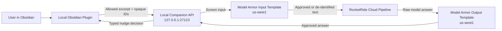

# Invisible AI Companion for Obsidian

## Central beta extension

The hosted beta is specified in [Central-Deployment.md](Central-Deployment.md). It supersedes this document’s local-only, single-user and no-persistence scope for hosted deployments. Folder consent, read-only vault access and credential/content log redaction remain required. The local proof remains available separately. Model Armor and RocketRide behavior described below has not been implemented or verified by the hosted beta.

## Document Role

This is the product, security, architecture, interaction, and acceptance contract for the first local release. Visual styling must use native Obsidian components and CSS variables; a separate visual token system is unnecessary until the implementation needs custom primitives.

## Vision

Create a quiet AI companion that reads only user-approved Obsidian notes, never writes to the vault, and appears only when it can add clear value.

Core principles:

- Quiet by default.
- Nudge, do not take over.
- Read-only forever.
- Local control before cloud processing.
- No content leaves the device without explicit folder consent.

## Locked Product Decisions

1. The first release targets one user on desktop Obsidian.
2. The Obsidian plugin and Python companion service run locally.
3. The companion binds only to `127.0.0.1:27123`.
4. Google Model Armor, RocketRide Cloud, and the configured LLM remain outbound cloud processors.
5. The plugin is the only component allowed to read the vault filesystem.
6. Vault access starts with an empty folder allow-list.
7. The plugin authenticates to the companion with a paired bearer token.
8. Model Armor screens both input and output in `us-west1` and fails closed.
9. Python is used for the companion and orchestration; TypeScript is used for the Obsidian plugin.
10. Multi-user identity is documented as a future extension but is not implemented in the first release.

## Non-Negotiables

1. The assistant must never create, edit, rename, move, or delete vault content.
2. All prompts must be optional, dismissible, and accessible without hover.
3. If confidence is low, a response is stale, or a security/upstream dependency fails, show nothing.
4. Raw note paths, vault roots, credentials, excerpts, and model responses must not appear in logs.
5. No RocketRide, OpenRouter, Google Cloud, or other provider credential may be shipped in the plugin.

## First-Release Scope

### Included

- Reflection nudges after idle or save events.
- Deterministic local changelog reminders.
- Explicit folder consent and local scope enforcement.
- Local plugin-to-companion pairing and revocation.
- Model Armor input and output screening.
- RocketRide-hosted nudge generation.
- Accessible indicator, side panel, settings, pause, and connection states.

### Deferred

- Experience linking and RAG over prior notes.
- GitHub-backed note mirrors.
- Scheduler, notification, retrieval, or filesystem MCP services.
- Public hosting and real multi-user accounts.
- Mobile Obsidian support.
- Provider adapter frameworks and A/B infrastructure.

## Outcomes

1. Reflection coach: ask one concise question when a blocker is described without meaningful root-cause reasoning.
2. Changelog reminder: locally detect inactivity and offer a short checkpoint.
3. Preserve uninterrupted writing when the companion or any cloud dependency is unavailable.

Experience linking remains a planned later outcome after ingestion, deletion, authorization, and retention semantics are designed.

## Architecture



The local companion is the authentication, schema-validation, security-policy, and cloud-orchestration boundary. It never receives a vault root and has no filesystem endpoint.

## End-to-End Request Flow

1. The plugin observes an idle, save, or manual trigger.
2. The plugin checks folder consent, mode settings, quiet hours, cooldown, and daily budget locally.
3. The plugin reads only the approved excerpt and assigns opaque installation, vault, and note identifiers.
4. The plugin sends an authenticated, versioned request to the loopback companion.
5. The companion validates the bearer token, identifier ownership, content bounds, and request schema.
6. Model Armor screens the input. A blocking or indeterminate verdict stops the flow.
7. The companion sends only approved or de-identified text to RocketRide.
8. The companion extracts exactly one answer without streaming it to the plugin.
9. Model Armor screens the answer. A blocking or indeterminate verdict stops the flow.
10. The companion validates and returns a typed decision.
11. The plugin renders only if the request ID and note revision are still current.

## Local Authentication and Pairing

### Network Boundary

- Listen only on IPv4 loopback at `127.0.0.1:27123`.
- Reject non-loopback peers and unexpected `Host` values.
- Emit no CORS allow headers and reject browser preflight requests.
- Require `Authorization: Bearer <token>` on every content-bearing endpoint.
- Keep `GET /healthz` unauthenticated and free of configuration or identity details.

### Pairing

1. The user starts a pairing window from the companion CLI.
2. The service generates a CSPRNG one-time code, holds it only in memory, and expires it after 60 seconds or five failed attempts.
3. The plugin sends the code with its opaque installation and vault IDs to `POST /v1/pair`.
4. The service returns a 256-bit bearer token and closes the pairing window.
5. The plugin stores the token using Obsidian `app.secretStorage`; minimum Obsidian version is 1.11.4.
6. The companion stores only the SHA-256 token digest and the bound opaque IDs in a private local state file. The directory is owner-only and the file mode is `0600` where supported.
7. Token comparison is constant-time. Rotation or revocation immediately invalidates the previous token.

The local threat boundary protects against browser-to-localhost requests and accidental access by unrelated local applications. Compromise of the same operating-system account is outside the first-release threat model because such an attacker can already read the vault.

## Vault Identity and Scope

- The plugin generates UUIDv4 values for `installationId`, `vaultId`, and `noteId`.
- The path-to-note-ID map remains local and preserves IDs across detected renames.
- No request contains a vault root, absolute path, or vault-relative note path.
- The initial folder allow-list is empty.
- Paths are canonicalized before scope checks; absolute paths, `..`, and sibling-prefix matches are rejected.
- Removing a folder from scope immediately prevents future transmissions from that folder.
- Deleting a note deletes its local ID mapping. No cloud deletion is required in the first release because note content and embeddings are not persisted by this application.

## Google Model Armor

Model Armor is an external Google Cloud security service. It does not provide local authentication, vault authorization, consent, or offline protection.

### Configuration

- Location: `us-west1`.
- Authentication: Google Application Default Credentials; no service-account key files.
- Runtime roles: `roles/modelarmor.user` and `roles/modelarmor.viewer` only.
- Use separate input and output templates.
- Disable sanitize-operation payload logging.
- Cloud Audit Logs may retain API metadata but not prompt or response bodies.

### Input Template

- Prompt-injection and jailbreak detection at medium-and-above confidence.
- Malicious URL detection.
- Advanced Sensitive Data Protection with de-identification for selected credentials and personal identifiers.
- General responsible-AI topic filtering remains off for personal note input to avoid blocking legitimate journal content.

### Output Template

- Sensitive Data Protection.
- Malicious URL detection.
- Responsible-AI filters at high confidence.

### Enforcement Mapping

- No match: forward the original content.
- Sensitive-data-only match with non-empty transformed content: forward only the transformed content.
- Prompt injection, jailbreak, malicious URL, hard-safety, or mixed finding: block.
- Partial execution, timeout, provider error, malformed response, empty transformation, or unknown result: block.

The direct Model Armor API returns findings; the companion is responsible for enforcing these decisions. A blocked request produces no RocketRide call and no editor nudge. A blocked output never reaches the plugin.

Official references:

- [Model Armor overview](https://docs.cloud.google.com/model-armor/overview)
- [Sanitize prompts and responses](https://docs.cloud.google.com/model-armor/sanitize-prompts-responses)
- [Data residency](https://docs.cloud.google.com/model-armor/data-residency)
- [Access control](https://docs.cloud.google.com/model-armor/access-control/access-control-iam)

## RocketRide Integration

The current baseline is:

```text
chat -> llm_openai_api -> response_answers
```

The companion must call the chat pipeline through the documented `chat()` method, require exactly one `answers` result, and parse the answer into the typed response contract.

Rules:

- Replace the literal provider key in `default.pipe` with `${ROCKETRIDE_OPENROUTER_APIKEY}` before execution.
- Keep the pipeline `project_id` as a literal UUID because RocketRide does not substitute that field.
- Keep URI, RocketRide authentication, model endpoint, model name, and provider key in environment variables.
- Disable streaming callbacks so unscreened output cannot reach the plugin.
- Set pipeline tracing to none so note content is not captured in lane traces.
- Treat empty, multiple, or malformed answers as a blocked generation result.

No MCP service is required in the first release. Model inference and vector stores are native RocketRide components; local timing, policy, and UI remain in the plugin.

## Configuration and Secrets

Required environment variables:

- `ROCKETRIDE_URI`
- `ROCKETRIDE_APIKEY`
- `ROCKETRIDE_OPENROUTER_BASE_URL`
- `ROCKETRIDE_OPENROUTER_MODEL`
- `ROCKETRIDE_OPENROUTER_APIKEY`
- `GOOGLE_CLOUD_PROJECT`
- `MODEL_ARMOR_LOCATION=us-west1`
- `MODEL_ARMOR_INPUT_TEMPLATE`
- `MODEL_ARMOR_OUTPUT_TEMPLATE`

Rules:

1. Ignore `.env` and commit only placeholder values in `env.example`.
2. Never print or return configuration values that might contain credentials.
3. Rotate the existing literal OpenRouter credential before treating the project as safe.

## HTTP API Contract

### Endpoints

- `GET /healthz`: readiness only.
- `POST /v1/pair`: available only during the active pairing window.
- `DELETE /v1/pairing`: revoke the authenticated pairing.
- `POST /v1/nudges:evaluate`: evaluate an approved excerpt.

Unknown JSON fields are rejected. The maximum HTTP body is 64 KiB and the excerpt is limited to 8 KiB of UTF-8 data.

### Evaluation Request

```json
{
    "schemaVersion": 1,
    "requestId": "5f10bb46-ec2d-4fc5-b6cd-25eac5db1e71",
    "installationId": "e9382fe1-f383-47c6-9a32-cace44002651",
    "vaultId": "23626cd2-e72a-415d-ae8b-98c1d44bafcc",
    "noteId": "16c42420-cbc8-4b4a-a17a-457886117e49",
    "revision": 12,
    "createdAt": "2026-09-11T19:30:00Z",
    "trigger": "idle",
    "excerpt": "...",
    "signals": {
        "challengeScore": 0.81,
        "reflectionDepth": 0.33,
        "daysSinceUpdate": 2,
        "idleMs": 1450
    }
}
```

Signal constraints:

- Scores are between 0 and 1.
- `revision` is a positive, monotonically increasing integer per note.
- `daysSinceUpdate` and `idleMs` are non-negative integers.
- `trigger` is `idle`, `save`, or `manual`.

### Evaluation Response

Every response echoes `schemaVersion`, `requestId`, `noteId`, and `revision`, then uses exactly one decision variant:

- `show`: includes `mode`, `displayMode`, bounded `hint`, and `expiresAt`.
- `silent`: includes a non-sensitive reason such as `low_confidence` or `no_value`.
- `blocked`: includes only `security_policy`, `security_unavailable`, `generation_unavailable`, or `invalid_generation`.

Security-filter details and raw upstream errors remain local to the companion.

## Timing and Failure Behavior

- Allow one in-flight cloud evaluation per note.
- Cancel superseded local work when possible.
- Apply a ten-second total deadline with no automatic replay for interactive evaluations.
- Discard any response that is not the latest request ID and revision for the active note.
- Never display cached AI output after a failure.
- Companion, Model Armor, RocketRide, or LLM failure results in silence while writing continues normally.
- Deterministic changelog reminders may continue offline because they require no network or note transmission.

## Nudge Policy

The plugin owns the authoritative local policy:

1. Folder is explicitly allowed.
2. Mode is enabled.
3. Confidence is at least 0.75.
4. User has paused for at least 1,200 ms or has just saved.
5. Twenty-minute cooldown has elapsed.
6. Daily budget of three nudges is not exhausted.
7. Quiet hours and manual pause are inactive.

Three consecutive dismissals enable quiet mode for 24 hours. Policy counters remain local. Confidence must be evaluated separately for each mode before changing the threshold.

## Behavior by Goal

### Reflection Coach

Trigger: blocker language appears while reflection depth is low.

Example: “You described the challenge clearly. Which assumption failed, and what will you test next?”

### Changelog Reminder

Trigger: a locally identified changelog has not changed for at least two days. Check on plugin startup and relevant vault events; no background scheduler is required.

Example: “No changelog update in two days. What moved, what stalled, and what changed your mind?”

## Interaction and Accessibility Contract

- During active typing, queue results silently and never steal focus.
- Show a passive status indicator; open the full nudge in a side panel only on click, keyboard command, or explicit manual invocation.
- Do not require hover, animation, color alone, or pointer precision.
- Opened nudges remain available until dismissed; they do not auto-fade.
- Provide visible focus, semantic labels, keyboard traversal, screen-reader-compatible status text, and reduced-motion behavior.
- Use native Obsidian components, icons, typography, spacing, and theme CSS variables in light and dark modes.
- Support empty, connecting, paired, paused, offline, timed-out, blocked, and revoked states in settings without exposing note content.
- Provide “Why am I seeing this?”, “What was sent?”, pause, disable mode, rotate pairing, and revoke pairing controls.

## Privacy and Data Lifecycle

- Before first use, explain that approved excerpts are processed by Google Model Armor, RocketRide Cloud, and the configured model provider.
- Keep the folder allow-list empty until the user opts in.
- Show the exact pending excerpt in the manual evaluation flow and make the active scope visible in settings.
- Do not persist excerpts or model responses in the companion.
- Do not create embeddings or a cloud note index in the first release.
- Disable Model Armor sanitize-operation payload logging and RocketRide traces.
- Application logs may contain only request ID, stage, duration, and coarse verdict.
- Revoking pairing prevents further requests immediately; removing scope prevents future reads and transmissions immediately.

## Future Hosted Identity

A later hosted deployment replaces the local bearer validator at the HTTP boundary with OIDC Authorization Code plus PKCE.

The authorization model will bind:

```text
authenticated subject -> device installation -> opaque vault -> opaque note
```

Every request must prove ownership of the installation and vault. The plugin remains the only vault reader; the hosted service never mounts a vault or accepts a filesystem path. Provider selection, account storage, callbacks, and refresh-token handling are deliberately deferred.

## Suggested Module Layout

### Obsidian Plugin

- `plugin/src/main.ts`: lifecycle and commands.
- `plugin/src/settings.ts`: consent, pairing, and local policy controls.
- `plugin/src/scope.ts`: canonical path allow-list and opaque ID mapping.
- `plugin/src/client.ts`: authenticated, cancellable companion requests.
- `plugin/src/nudge-view.ts`: accessible indicator and side panel.

### Python Companion

- `service/app.py`: FastAPI entry point and loopback configuration.
- `service/models.py`: strict versioned request and response schemas.
- `service/auth.py`: pairing, bearer verification, rotation, and revocation.
- `service/model_armor.py`: input/output screening and verdict mapping.
- `service/rocketride.py`: pipeline lifecycle and answer extraction.
- `service/orchestrator.py`: Model Armor to RocketRide to Model Armor sequence.

Files must remain responsibility-focused; avoid provider frameworks or interfaces without a second implementation.

## Verification and Acceptance

Security-first TDD is required.

### Automated

1. Missing, wrong, expired, and revoked tokens receive `401`; a valid paired token survives service restart.
2. The service is reachable through `127.0.0.1` and not through non-loopback interfaces.
3. Host-header, CORS-preflight, oversized-body, unknown-field, and malformed-identifier requests are rejected.
4. Folder checks cover allowed children, sibling prefixes, traversal, absolute paths, and removed folders.
5. Input blocks prevent RocketRide calls; output blocks prevent plugin delivery.
6. Every Model Armor match, transform, partial, timeout, malformed, and unknown state is handled exhaustively.
7. Late response A is discarded after newer request B for the same note.
8. Sentinel note text, tokens, and authorization headers never appear in captured logs.
9. RocketRide tracing and streaming remain disabled and exactly one answer is required.

### End to End

Using a temporary vault and the live loopback service:

1. Pair the plugin and companion.
2. Evaluate an allowed note and display an approved nudge.
3. Prove an excluded note never produces a network request.
4. Revoke the token and observe authenticated requests fail.
5. Simulate Model Armor and RocketRide failures and observe uninterrupted writing with no nudge.
6. Restart the companion and verify the valid pairing remains usable.

### Manual Obsidian QA

- Keyboard-only pairing, settings, indicator, panel, dismissal, and pause.
- Screen-reader labels and status announcements.
- Focus remains in the editor unless the user opens the panel.
- Light/dark themes and narrow/wide side panels.
- Offline writing, companion restart, timeout, and revoked-token recovery.

Before release, run one credentialed smoke test against the real `us-west1` Model Armor templates and RocketRide pipeline.

## Delivery Order

1. Rotate the exposed key and establish safe environment configuration.
2. Build pairing, loopback enforcement, and strict API schemas with failing tests first.
3. Build local plugin scope, opaque identity, and stale-response controls.
4. Add and verify Model Armor input enforcement.
5. Integrate RocketRide without streaming or tracing.
6. Add and verify Model Armor output enforcement.
7. Complete the accessible Obsidian interaction states.
8. Run automated, end-to-end, and manual Obsidian verification.

## Product Promise

“A quiet, read-only companion that helps you think better without taking control of your notes.”
